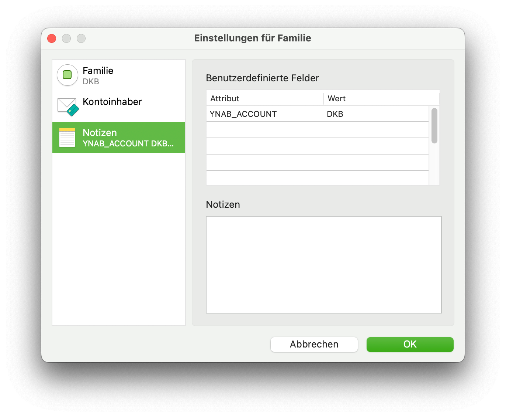

# MoneyMoney Sync to YNAB

Can Sync transactions from MoneyMoney directly to YNAB (Web). Must be run on the same Mac as MoneyMoney is running.


# Install

```
composer install
```

# Setup

Edit the accounts in MoneyMoney that you wish to sync to YNAB. In the notes window add a `YNAB_ACCOUNT` attribute with the YNAB name as value:




```
php bin/console app:setup
```

Create a new YNAB API token here: https://app.youneedabudget.com/settings/developer


## Reference Accounts

There is a special account name `reference` this can be used for PayPal and other accounts to match transaction names.
As PayPal transaction names on the bank account are not very detailed. The payee and description of the PayPal transaction is then synced to YNAB instead of the payee and description from the bank account transaction.   

# Sync
```
php bin/console app:sync
```
